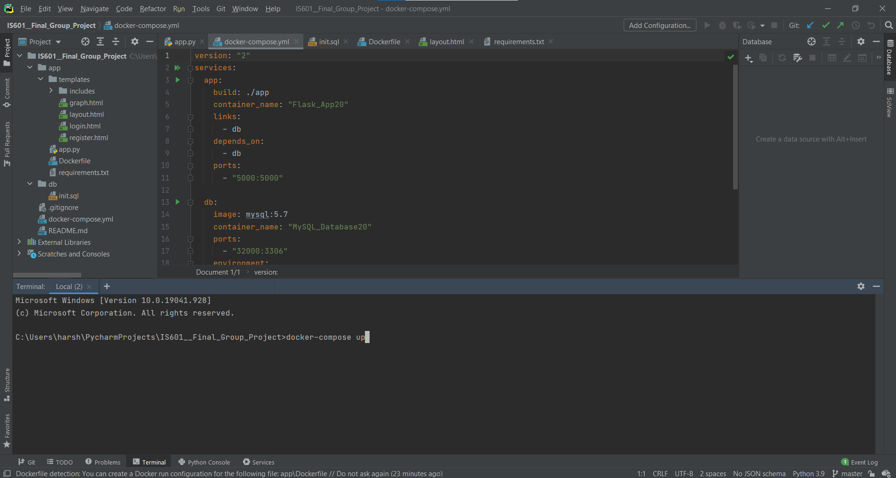
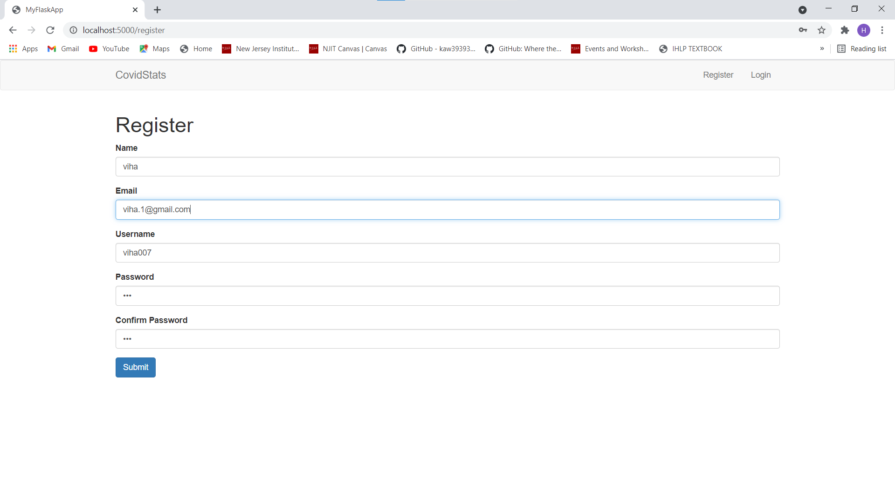
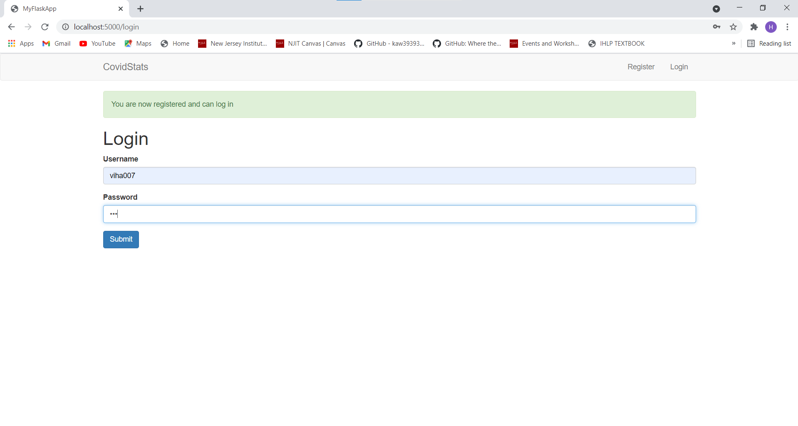
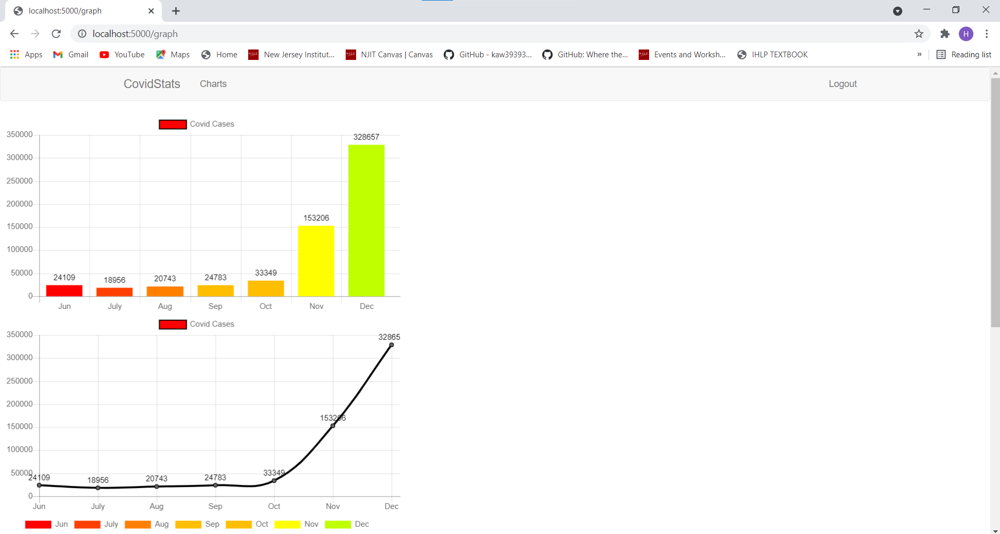

## IS601 Final Group Project – Spring 2021 
## Description:
We built an app using Docker, Python and My SQL database. Our App has a registration and login feature. Since, all the datasets in the present day are related to covid. We have selected a dataset on the number of covid cases between June – December 2020. We used Chart.js to implement this feature.

### Team: 
1. Harshad Jadhav
2. Vihagendra Kalakuntla
### Features worked on:
1. Registration and login – Harshad Jadhav and Vihagendra Kalakuntla
2. Charts – Harshad Jadhav and Vihagendra Kalakuntla

### Installation:
+ The app can be cloned from Git repository
+ To run the project, type docker-compose up command in Pycharm terminal.
+ Wait, for a minute till it runs, then open browser and type "localhost:5000/register"
+ Complete registration and Login with registered Username and Password.
+ You will be able to see the charts with covid stats, you can logout when you are done.

### Step by Step Walkthrough:
1. Run "docker-compose up" command

2. After running, go to browser and type the url "localhost:5000/register"

3. After registration, you can login with the registered details.

4. After logging in you can view the charts that were plotted from our database. You can logout once you are done.
 
